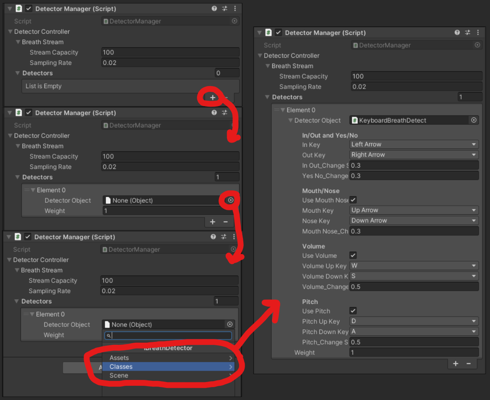
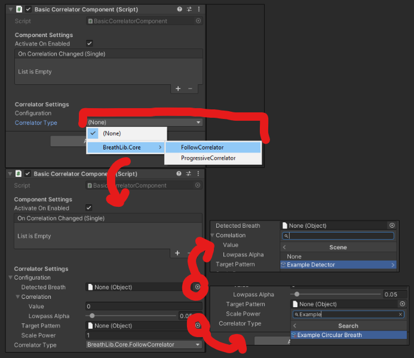
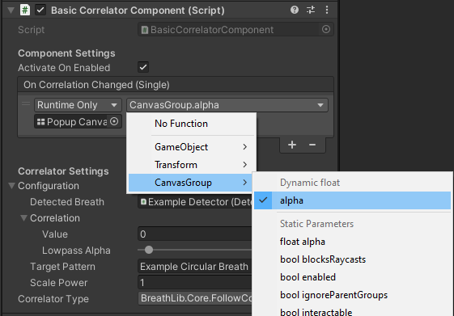

# Breath Library!
The breath library is a plugin that enables easy to configure Breath Detection in any project. All features are briefly covered in this document, and more information can always be found by looking at the "Docs~" folder. The core features include:
- [Compatibility with different hardware](./Docs~/InputAndHardware.md) for different types of input.
- [Breath patterns](./Docs~/BreathPatterns.md) for representing different breathing techniques
- [Breath Correlators](./Docs~/BreathCorrelators.md) for different comparisons between breaths for game interactions.
- [Session data](./Docs~/SessionData.md) for long-term user data.
- [Unity Specific Serialization](./Docs~/SerializationAndAttributes.md) to help easy setup and configuration.

All of the above are built-in and extendable. This means that the core features can be used as-is, or extended to fit your needs. For example, you can create your own breath patterns, or your own breath correlators.

For a fully playable experience for sampling the plugin, please visit the [AiB-Ladder Project](https://github.com/Versebuilding/AiB-Ladder).

## Getting Started
There are three main components that will be needed in order to begin using the Breath Library for game interactions.

1. **Breath Input**: Add a `DetectorManager` component to a game object in your scene. This component will be responsible for managing the input from the hardware to a `BreathStream`.

	a. **Add `DetectorManager` component** to a game object in your scene.

	b. **Add a detector** to the `Detectors` list.

	c. **Assign a detector** to the detector configuration. In most cases, you will want to use the classes option to create a breath detector from a class. The example shows the `KeyboardBreathDetect` class, which is a simple class that uses the keyboard to simulate a breath detector.

2. **Breath Correlation**: Add a `CorrelationComponent` script to a game object in your scene. This component will be responsible for analyzing the the `BreathStream` created by the `DetectorManager`.

	a. **Add `BasicCorrelationComponent` component** to a game object in your scene.

	b. **Assign a correlator** to the correlator configuration. 

	c. **Assign the Detector Manager** as the Detected breath. The Detector will be under the scene tab as the component that we are linking exists in the unity scene. This will assign the `BreathStream` reference that is attached to the `DetectorManager` component behind the scenes.

	(d.) **Assign additional data** to the correlator configuration. With this example, the correlator also needs a target pattern to compare against. The pattern is set by using an Asset (Scriptable Object).

3. **Assign a function** or dynamic float to the unity event. You can create a `MonoBehaviour` that has a function that takes in a float or use existing components. In the example, a canvas group is used to show a fade in and out of a UI element depending on correlation.

## Learn More
The above will get you one float value that can be used in game based on the users breathing. One float can do a lot, like controlling the strength of spells, or the speed of a character. However, you may be looking for more ambitious interactions.

If you are looking to understand how the breath library works and all the ways it can be used, please read the [Advanced Usage](./Docs~/AdvancedUsage.md) document.